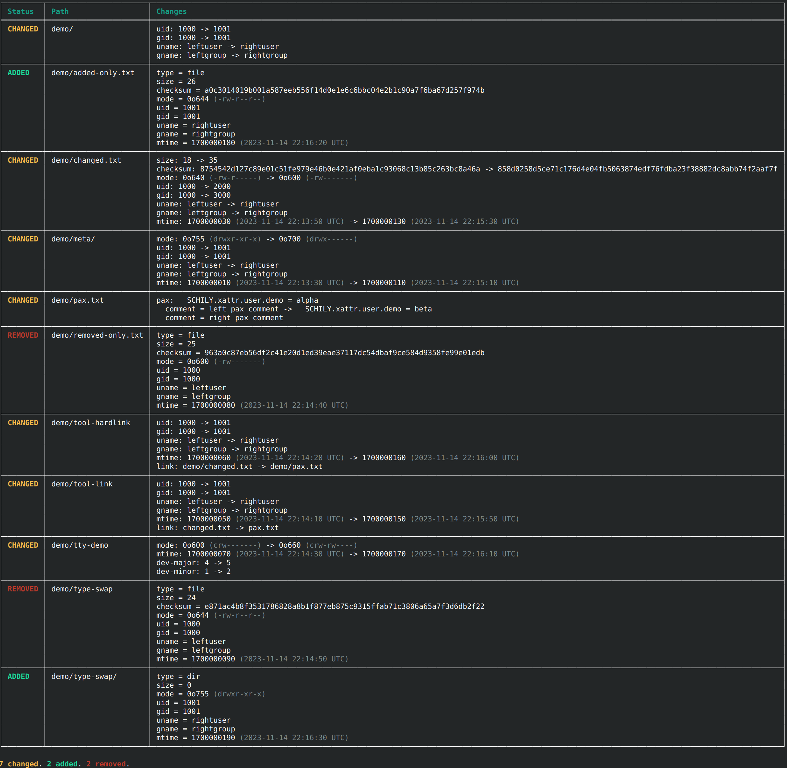

# tardiff

`tardiff` compares two tar archives, including compressed tar files, and shows
how their entries differ.

## Installation

```bash
cargo install tardiff
```

From a local checkout:

```bash
cargo install --path .
```

## Usage

```bash
cargo run -- <left.tar> <right.tar>
```

All options:

```
Compare two tar archives by entry name, size, and checksum

Usage: tardiff [OPTIONS] <LEFT> <RIGHT>

Arguments:
  <LEFT>   Left-hand archive path
  <RIGHT>  Right-hand archive path

Options:
  -q, --quiet     Suppress progress and diff output. Exit status still indicates equality
  -c, --compact   Use the compact rendering for the selected output mode
  -s, --spacious  Use the spacious rendering for the selected output mode
  -t, --table     Render differences as a table
  -l, --list      Render differences as a single unaligned line per entry
  -h, --help      Print help
```

Examples:

```bash
cargo run -- archive-a.tar archive-b.tar
cargo run -- --table archive-a.tar archive-b.tar
cargo run -- --table --spacious archive-a.tar archive-b.tar
cargo run -- --list --compact archive-a.tar archive-b.tar
cargo run -- --quiet archive-a.tar archive-b.tar
```

## Screenshot



## Exit Codes

- `0`: archives are equal
- `1`: archives differ
- `2`: application error

## Example Archives

This repo includes a generator for sample archives that exercise the major diff
paths:

```bash
cargo run --bin generate_examples
```

That writes:

- `examples/left.tar`
- `examples/right.tar`

Then you can try:

```bash
cargo run -- examples/left.tar examples/right.tar
cargo run -- --table examples/left.tar examples/right.tar
cargo run -- --table --spacious examples/left.tar examples/right.tar
```
